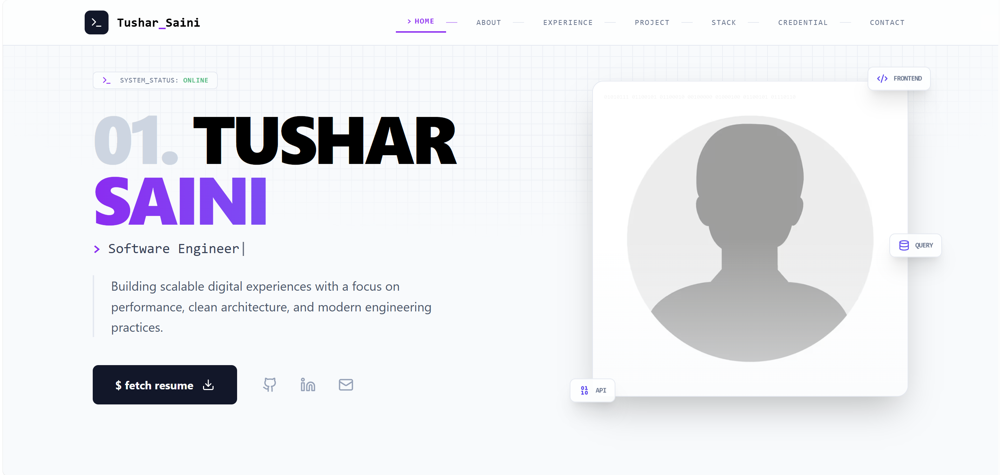

# My Portfolio 🚀

A modern, responsive developer portfolio built to showcase my skills, projects, experience, and credentials in a clean and professional way. This portfolio is designed with a recruiter-first mindset, focusing on clarity, performance, and real-world impact.

---

## ✨ Features

* **Clean & Professional UI** – Minimal, recruiter-friendly design
* **Responsive Layout** – Optimized for desktop, tablet, and mobile
* **Projects Showcase** – Highlighting real-world and academic projects
* **Credentials & Achievements** – Certifications, hackathons, and learnings
* **Contact & Social Links** – Simple ways to connect and collaborate

---

## 🧭 Sections Overview

* **Home** – Quick introduction and personal branding
* **About** – Background, interests, and professional summary
* **Experience** – Work, internships, and hands-on exposure
* **Projects** – Selected projects with descriptions and tech stack
* **Stack** – Technologies, tools, and frameworks
* **Credentials** – Certifications, achievements, and learning milestones
* **Contact** – Direct communication and social links

---

## 🛠️ Tech Stack

* **Frontend:** React.js
* **Styling:** Tailwind CSS
* **Icons:** Lucide Icons
* **Backend / Services:** Appwrite
* **Deployment:** Vercel 

---

## ⚙️ Installation & Setup

```bash
# Clone the repository
git clone https://github.com/TusharSaini999/Portfolio.git

# Navigate to the project directory
cd Portfolio

# Install dependencies
npm install

# Start the development server
npm run dev
```

---

## 🌐 Environment Variables

Create a `.env` file in the root directory and add the following:

```env
VITE_APPWRITE_PROJECT_ID="ID_OF_PROJECT"
VITE_APPWRITE_PROJECT_NAME="NAME_OF_PROJECT"
VITE_APPWRITE_ENDPOINT="ENDPOINT_OF_PROJECT"
VITE_APPWRITE_DB_ID="DB_ID"
VITE_APPWRITE_TABLE_CONTECT_ID="TABLE_ID"
```

---

## 📸 Preview



**Live Demo:** [https://tusharsaini.tech](https://tusharsaini.tech)

---

## 🚀 Future Enhancements

* Dark / Light mode toggle Section
* Blog or writing section
* Project filtering by tech stack
* Performance and SEO optimizations

---

## 🤝 Contributing

Contributions, suggestions, and improvements are welcome!

1. Fork the repository
2. Create a new branch
3. Commit your changes
4. Open a pull request

---

## 📬 Contact

Open to job opportunities and collaborations.

* **Email:** [tusharsaini.in@gmail.com](mailto:tusharsaini.in@gmail.com)
* **LinkedIn:** [https://www.linkedin.com/in/tushar-saini-105865373/](https://www.linkedin.com/in/tushar-saini-105865373/)
* **GitHub:** [https://github.com/TusharSaini999](https://github.com/TusharSaini999)

---

## 📄 License

*This project is licensed under the **********GNU General Public License v3.0.**********.*

---

⭐ If you like this portfolio, consider giving the repository a star!
